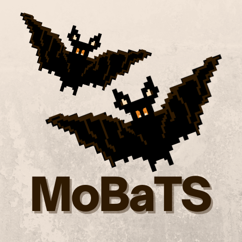

<p align="center">
  
</p> 

# MoBaTS (Model-based Test Synthesis)
MoBaTS is an internal DSL written in Scala 3 for the model-based testing of RESTful APIs.

MoBaTS was developed as a part of my Master thesis Jan 2023. You can access my thesis here:
https://findit.dtu.dk/en/catalog/63f56b6068544291f7db1f99

---
## Requirements
- Java 11
- sbt (1.8)
- Scala 3

## Installation
1. Open a terminal and navigate to the [MoBaTS project](MoBaTS)
2. Run `sbt publishLocal`


## Usage
After the installation, you should be able to import MoBaTS as a library dependency in you Scala 3 project. However, it is recommended that you get familiar with the tool by exploring the [examples project](examples).

### examples project
The examples project shows an example of how MoBaTS can be used. The [PetClinic](examples/src/main/scala/PetClinic) package contains some example models for testing the [PetClinic API](https://github.com/spring-petclinic/spring-petclinic-rest). [Main.scala](examples/src/main/scala/PetClinic/Main.scala) contains a script showing how to graph and run models. Note that the [PetClinic API](https://github.com/spring-petclinic/spring-petclinic-rest) needs to be running locally if you want to run the models. You can do so by downloading it and running the command:
```
mvn spring-boot:run
```
Then, you can navigate to the [examples project](examples) and run `sbt run` to run [Main.scala](examples/src/main/scala/PetClinic/Main.scala).
